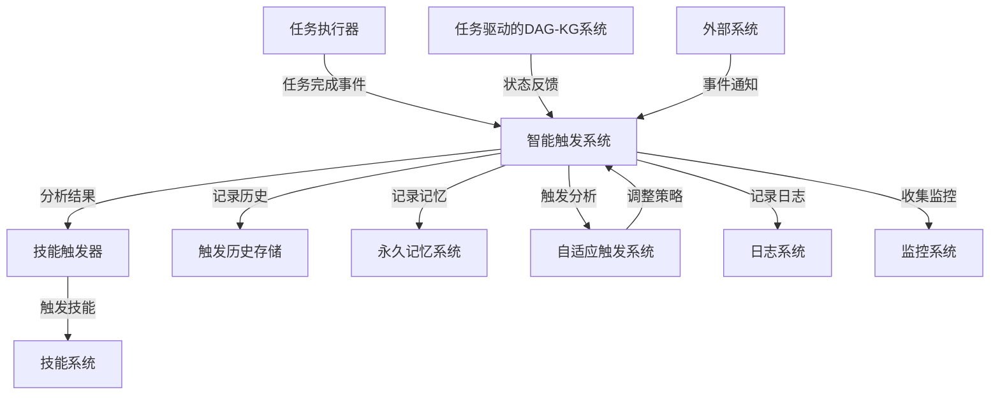

# 智能触发系统文档

## 1. 系统概述

智能触发系统是一个基于任务完成事件的自动技能触发机制，位于整个系统的核心位置，连接任务执行系统和技能执行系统。系统通过分析任务的类型、重要性和内容相关性，决定是否触发相应的技能，实现任务驱动的自动化技能触发。

## 2. 核心功能

### 2.1 任务分析
- **任务类型提取**：基于关键词匹配提取任务类型
- **重要性计算**：基于任务名称、描述和结果计算重要性
- **相关性分析**：基于关键词匹配分析内容相关性
- **置信度计算**：综合重要性和相关性计算触发置信度
- **操作推荐**：基于任务类型推荐相应的操作

### 2.2 技能触发
- **多技能支持**：支持触发多种技能，包括任务记录技能和任务驱动的DAG-KG技能
- **技能映射**：根据操作类型映射到相应的技能
- **智能决策**：基于分析结果智能决定是否触发技能

### 2.3 自适应策略
- **历史数据分析**：基于历史触发数据调整触发策略
- **阈值调整**：根据成功率动态调整触发阈值
- **权重调整**：根据任务类型成功率调整权重

### 2.4 缓存机制
- **分析结果缓存**：缓存分析结果，提高系统性能
- **任务类型缓存**：缓存任务类型提取结果
- **重要性缓存**：缓存重要性计算结果
- **相关性缓存**：缓存相关性分析结果
- **缓存清理**：定期清理过期缓存

### 2.5 安全性措施
- **输入验证**：验证任务信息和外部事件的有效性
- **权限控制**：检查事件来源是否被允许
- **异常处理**：处理技能触发过程中的异常情况

### 2.6 监控和日志
- **详细日志**：记录系统运行的详细日志
- **监控数据**：收集系统运行的监控数据
- **日志清理**：定期清理旧日志
- **监控端点**：提供API端点获取监控数据

### 2.7 外部系统接口
- **事件处理**：处理来自外部系统的事件
- **API端点**：提供API端点接收外部事件

## 3. 系统架构



## 4. API接口

### 4.1 智能触发状态
- **GET /api/intelligent-trigger/status**：获取智能触发系统状态
- **POST /api/intelligent-trigger/toggle**：切换智能触发状态
- **GET /api/intelligent-trigger/metrics**：获取智能触发系统监控数据
- **POST /api/intelligent-trigger/external-event**：处理外部事件

### 4.2 技能相关
- **GET /api/skills**：获取技能列表
- **POST /api/skills/trigger**：触发技能

## 5. 触发条件

### 5.1 任务类型相关性
任务类型必须是以下之一：
- `knowledge_extraction`（知识提取）
- `dag_kg_alignment`（DAG-KG对齐）
- `system_optimization`（系统优化）
- `intelligent_iteration`（智能迭代）
- `skill_development`（技能开发）
- `system_improvement`（系统改进）
- `task_management`（任务管理）

### 5.2 触发阈值
- **任务重要性**：重要性分数 >= 3（满分5分）
- **内容相关性**：相关性分数 >= 0.15（满分1分）
- **触发置信度**：基于重要性和相关性计算，置信度 >= 0.43

## 6. 推荐操作

根据任务类型推荐不同的操作：
- **knowledge_extraction**：extract_knowledge（知识提取）
- **dag_kg_alignment**：align_dag_kg（DAG-KG对齐）
- **system_optimization**：full_iteration（完整迭代）
- **intelligent_iteration**：full_iteration（完整迭代）
- **skill_development**：full_iteration（完整迭代）
- **task_management**：record_task（记录任务）
- **其他**：full_iteration（完整迭代）

## 7. 配置文件

### 7.1 触发策略文件
- **文件路径**：`src/superpowers/storage/trigger_strategy.json`
- **配置项**：
  - `minimumImportance`：最小重要性阈值
  - `minimumRelevance`：最小相关性阈值
  - `minimumConfidence`：最小置信度阈值
  - `keywordWeights`：任务类型权重

### 7.2 触发历史文件
- **文件路径**：`src/superpowers/storage/trigger_history.json`
- **内容**：记录触发历史，最多保存100条

### 7.3 日志文件
- **文件路径**：`src/superpowers/storage/intelligent_trigger.log`
- **内容**：系统运行日志，定期清理

## 8. 使用示例

### 8.1 触发任务记录技能
```javascript
// 任务信息
const taskInfo = {
  id: 'test_task_1',
  name: '测试任务管理',
  description: '这是一个任务管理任务，需要记录和管理任务'
};

// 任务结果
const taskResult = {
  success: true,
  data: '任务管理结果',
  impact: 0.6
};

// 分析任务完成
await intelligentTrigger.analyzeTaskCompletion(taskInfo, taskResult);
```

### 8.2 处理外部事件
```javascript
// 外部事件
const event = {
  type: 'system_update',
  data: { version: '1.0.0' },
  source: 'system',
  name: '系统更新',
  description: '系统版本更新到1.0.0'
};

// 处理外部事件
const result = await intelligentTrigger.handleExternalEvent(event);
console.log(result);
```

### 8.3 获取监控数据
```javascript
// 获取监控数据
const metrics = intelligentTrigger.getMetrics();
console.log(metrics);
```

## 9. 性能优化

### 9.1 缓存优化
- **分析结果缓存**：有效期5分钟
- **任务类型缓存**：有效期10分钟
- **重要性缓存**：有效期10分钟
- **相关性缓存**：有效期10分钟
- **定期清理**：每10分钟清理一次过期缓存

### 9.2 算法优化
- **关键词匹配优化**：使用更高效的关键词匹配算法
- **自适应阈值**：根据历史数据动态调整触发阈值
- **任务类型权重**：根据任务类型成功率调整权重

## 10. 安全性

### 10.1 输入验证
- **任务信息验证**：验证任务信息的有效性
- **外部事件验证**：验证外部事件的有效性

### 10.2 权限控制
- **事件来源检查**：检查事件来源是否被允许
- **允许的来源**：system, api, external, unknown

### 10.3 异常处理
- **错误捕获**：捕获和处理系统运行过程中的异常
- **日志记录**：记录错误日志，便于故障排查

## 11. 故障排查

### 11.1 日志分析
- **日志文件**：`src/superpowers/storage/intelligent_trigger.log`
- **日志级别**：info, error
- **日志内容**：系统运行状态、错误信息、性能数据

### 11.2 监控数据
- **API端点**：`/api/intelligent-trigger/metrics`
- **监控指标**：任务数量、触发数量、失败数量、平均分析时间、缓存命中率等

### 11.3 常见问题
- **技能不触发**：检查任务类型、重要性、相关性是否满足触发条件
- **性能问题**：检查缓存是否正常工作，分析时间是否过长
- **错误日志**：查看日志文件，了解系统运行状态

## 12. 未来规划

### 12.1 功能扩展
- **多技能支持**：支持触发更多类型的技能
- **自定义触发规则**：允许用户自定义触发规则
- **触发预测**：基于历史数据预测可能的触发事件
- **外部系统集成**：支持与更多外部系统的集成

### 12.2 性能优化
- **机器学习集成**：使用机器学习模型提高触发决策的准确性
- **并行处理**：使用并行处理提高分析速度
- **批量处理**：支持批量任务分析，提高系统效率

### 12.3 安全性增强
- **身份验证**：添加身份验证机制
- **授权管理**：实现更细粒度的授权管理
- **数据加密**：对敏感数据进行加密存储

## 13. 总结

智能触发系统是一个基于任务完成事件的自动技能触发机制，通过分析任务的类型、重要性和内容相关性，决定是否触发相应的技能。系统采用了模块化设计，具有良好的可扩展性和可维护性。

通过智能触发系统，可以实现任务驱动的自动化技能触发，提高系统的智能化水平和自动化程度。系统可以根据任务的性质和重要性，自动选择合适的技能和操作，从而提高系统的整体效率和性能。

未来，通过持续优化算法和扩展功能，智能触发系统可以成为系统自动化和智能化的核心组件，为系统的持续迭代和优化提供支持。
