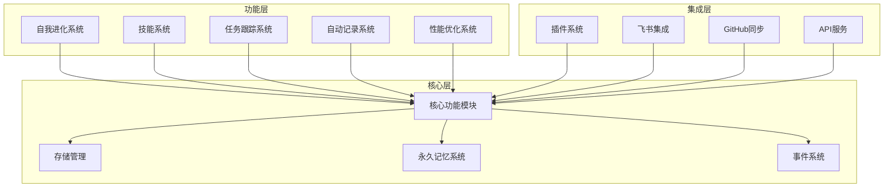
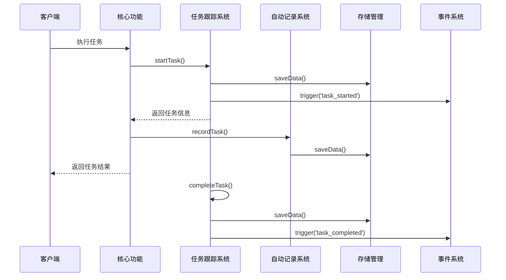
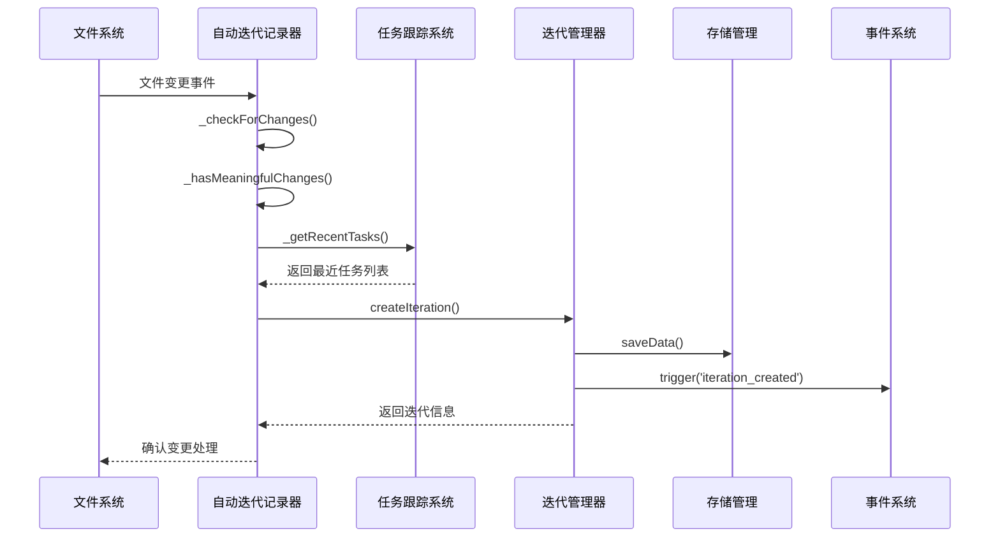

# Lossless Superpower JavaScript Version 系统设计文档

## 1. 系统概述

Lossless Superpower JavaScript Version 是一个 AI Agent Meta-capabilities Framework，旨在提供强大的元能力和自我进化能力，使AI代理能够自主学习、优化和执行任务。

### 1.1 核心价值

- **自我进化**：系统能够根据用户反馈和执行结果自动优化自身能力
- **技能管理**：支持技能的发现、生成、优化和管理
- **任务跟踪**：自动记录和管理所有任务执行
- **迭代记录**：自动检测和记录系统变更，建立变更历史
- **知识管理**：构建和维护知识图谱，支持智能决策
- **插件扩展**：通过插件系统支持功能扩展
- **多系统集成**：支持与飞书、GitHub等外部系统集成

### 1.2 技术栈

- 运行时：Node.js 14.0+
- 开发语言：JavaScript
- 存储：文件系统（JSON格式）
- 通信：事件驱动架构
- 外部集成：HTTP/HTTPS API

## 2. 系统架构

### 2.1 整体架构



### 2.2 模块依赖关系

| 模块 | 主要职责 | 依赖模块 | 实现文件 |
|------|---------|----------|----------|
| api | 核心功能 | ./skill_manager, ./events, path | src\superpowers\api.js |
| autonomous_learning | 核心功能 | ../storage, ./permanent_memory, fs, path, compromise | src\superpowers\autonomous_learning.js |
| auto_iteration_config | 核心功能 | fs, path | src\superpowers\auto_iteration_config.js |
| auto_iteration_recorder | 核心功能 | chokidar, fs, path, ./iteration_manager, ./storage_manager, ./task_tracker | src\superpowers\auto_iteration_recorder.js |
| auto_optimizer | 核心功能 | fs, path | src\superpowers\auto_optimizer.js |
| auto_task_recorder | 核心功能 | ./task_tracker, ./permanent_memory, ./event_recorder, ./iteration_manager, fs, http, https, child_process, crypto, os | src\superpowers\auto_task_recorder.js |
| auto_test_runner | 核心功能 | fs, path, ./test_task_wrapper, ./task_runner | src\superpowers\auto_test_runner.js |
| community_manager | 核心功能 | fs, path | src\superpowers\community_manager.js |
| dag_manager | 核心功能 | fs, path | src\superpowers\dag_manager.js |
| data_migration | 核心功能 | fs, path | src\superpowers\data_migration.js |
| doc_generator | 核心功能 | fs, path, child_process | src\superpowers\doc_generator.js |
| events | 核心功能 |  | src\superpowers\events.js |
| event_analyzer | 核心功能 | fs | src\superpowers\event_analyzer.js |
| event_monitor | 核心功能 | fs | src\superpowers\event_monitor.js |
| event_recorder | 核心功能 | fs, path, ./skills/dag_query, ./skills/iteration_recorder | src\superpowers\event_recorder.js |
| feedback_manager | 核心功能 | fs, path | src\superpowers\feedback_manager.js |
| feishu_skill | 核心功能 | ./feishu_tools | src\superpowers\feishu_skill.js |
| feishu_tools | 核心功能 | @larksuiteoapi/node-sdk, @larksuiteoapi/node-sdk | src\superpowers\feishu_tools.js |
| fuzzy_match | 核心功能 |  | src\superpowers\fuzzy_match.js |
| github_sync | 核心功能 | fs, path, child_process, ./doc_generator | src\superpowers\github_sync.js |
| gnn_reasoner | 核心功能 | uuid | src\superpowers\gnn_reasoner.js |
| index | 核心功能 | ./plugin_system, ./permanent_memory, ./self_evolution, ./auto_iteration_recorder, ./feishu_tools, ./feishu_skill, ./skill_discovery | src\superpowers\index.js |
| intelligent_prediction | 核心功能 | fs, path, ml | src\superpowers\intelligent_prediction.js |
| iteration_manager | 核心功能 | fs, path, ./storage_manager | src\superpowers\iteration_manager.js |
| iteration_predictor | 核心功能 | fs, path, ./iteration_manager, ml, ml, ml, ml, ml | src\superpowers\iteration_predictor.js |
| kg_dag_integration | 核心功能 | ./dag_manager, ./autonomous_learning | src\superpowers\kg_dag_integration.js |
| kg_dag_integration_enhanced | 核心功能 | ./dag_manager, ./autonomous_learning, uuid, fs, path | src\superpowers\kg_dag_integration_enhanced.js |
| knowledge_graph_embedding | 核心功能 | uuid, fs, path | src\superpowers\knowledge_graph_embedding.js |
| knowledge_graph_reasoner | 核心功能 | ./autonomous_learning, uuid, fs, path | src\superpowers\knowledge_graph_reasoner.js |
| machine_learning | 核心功能 | fs, path, ml | src\superpowers\machine_learning.js |
| multi_dimensional_optimizer | 核心功能 | fs, path, os, systeminformation | src\superpowers\multi_dimensional_optimizer.js |
| path_reasoner | 核心功能 | uuid | src\superpowers\path_reasoner.js |
| performance_optimizer | 核心功能 | uuid, os | src\superpowers\performance_optimizer.js |
| permanent_memory | 核心功能 | ../storage, fs, path | src\superpowers\permanent_memory.js |
| plugin_system | 核心功能 | fs, path, ./events, unzipper, fs, path, rimraf | src\superpowers\plugin_system.js |
| rule_reasoner | 核心功能 | uuid | src\superpowers\rule_reasoner.js |
| security_manager | 核心功能 | fs, path, crypto | src\superpowers\security_manager.js |
| self_evolution | 核心功能 | fs, path, ./skill_manager, ./events | src\superpowers\self_evolution.js |
| skill_analytics | 核心功能 | fs, path | src\superpowers\skill_analytics.js |
| skill_condition_evaluator | 核心功能 |  | src\superpowers\skill_condition_evaluator.js |
| skill_discovery | 核心功能 | fs, path, js-yaml | src\superpowers\skill_discovery.js |
| skill_generator | 核心功能 | fs, path, uuid, compromise | src\superpowers\skill_generator.js |
| skill_knowledge_graph | 核心功能 | fs, path, uuid | src\superpowers\skill_knowledge_graph.js |
| skill_loader | 核心功能 | fs, path, yaml | src\superpowers\skill_loader.js |
| skill_manager | 核心功能 | fs, path, yaml, ./fuzzy_match, ./events | src\superpowers\skill_manager.js |
| skill_market | 核心功能 | fs, path, uuid | src\superpowers\skill_market.js |
| skill_optimizer | 核心功能 | fs, path, uuid | src\superpowers\skill_optimizer.js |
| skill_scanner | 核心功能 | fs, path, yaml, chokidar | src\superpowers\skill_scanner.js |
| skill_security_scanner | 核心功能 | fs, path, crypto | src\superpowers\skill_security_scanner.js |
| skill_trigger | 核心功能 | ./fuzzy_match, ./skills/dag_query, ./skills/iteration_recorder, ./skills/lesson_collector, ./skills/self_introspection | src\superpowers\skill_trigger.js |
| skill_version_detector | 核心功能 | fs, path, crypto | src\superpowers\skill_version_detector.js |
| storage_manager | 核心功能 | fs, path, zlib | src\superpowers\storage_manager.js |
| sync_monitor | 核心功能 | fs, path | src\superpowers\sync_monitor.js |
| sync_scheduler | 核心功能 | fs, path, ./github_sync | src\superpowers\sync_scheduler.js |
| system_identity | 核心功能 | ./permanent_memory | src\superpowers\system_identity.js |
| task_analyzer | 核心功能 | fs, path, crypto | src\superpowers\task_analyzer.js |
| task_runner | 核心功能 | ./task_tracker, ./iteration_manager, ./permanent_memory | src\superpowers\task_runner.js |
| task_tracker | 核心功能 | fs, path, ./events | src\superpowers\task_tracker.js |
| temporal_reasoner | 核心功能 | uuid | src\superpowers\temporal_reasoner.js |
| test_hooks | 核心功能 | ./permanent_memory | src\superpowers\test_hooks.js |
| test_result_recorder | 核心功能 | fs, path, ./permanent_memory, ./iteration_manager | src\superpowers\test_result_recorder.js |
| test_task_wrapper | 核心功能 | ./task_runner, ./permanent_memory | src\superpowers\test_task_wrapper.js |
| test_verification | 核心功能 | fs, path, ./permanent_memory, ./task_runner, ./test_task_wrapper, ./test_hooks, ./test_result_recorder | src\superpowers\test_verification.js |
| user_experience | 核心功能 | fs, path | src\superpowers\user_experience.js |
| user_partner | 核心功能 | fs, path | src\superpowers\user_partner.js |
| webhook_manager | 核心功能 | fs, path, https, http, crypto | src\superpowers\webhook_manager.js |

## 3. 核心模块设计

### 3.12 events 模块 (src\superpowers\events.js)

#### 底层实现：
- 核心功能模块

#### 核心类：
- **EventManager**

### 3.22 index 模块 (src\superpowers\index.js)

#### 底层实现：
- 核心功能模块

### 3.34 permanent_memory 模块 (src\superpowers\permanent_memory.js)

#### 底层实现：
- 核心功能模块

#### 核心类：
- **PermanentMemorySystem**

### 3.52 storage_manager 模块 (src\superpowers\storage_manager.js)

#### 底层实现：
- 核心功能模块

#### 关键函数：
- **storeData(category, data, options = {})**
- **readData(category, fileName)**
- **listFiles(category, options = {})**
- **archiveOldData(category, days)**
- **cleanupOldData(days)**
- **getStorageStats(undefined)**
- **optimizeStorage(undefined)**
- **generateStorageReport(undefined)**
- **backupStorage(backupName)**
- **restoreStorage(backupPath)**

#### 核心类：
- **StorageManager**

## 4. 功能模块设计

### 4.4 auto_iteration_recorder 模块 (src\superpowers\auto_iteration_recorder.js)

#### 底层实现：
- 功能模块

#### 关键函数：
- **startAutoIterationRecorder(config = {})**
- **stopAutoIterationRecorder(undefined)**
- **getAutoIterationStatus(undefined)**
- **triggerIteration(undefined)**

### 4.6 auto_task_recorder 模块 (src\superpowers\auto_task_recorder.js)

#### 底层实现：
- 功能模块

### 4.33 performance_optimizer 模块 (src\superpowers\performance_optimizer.js)

#### 底层实现：
- 功能模块

### 4.38 self_evolution 模块 (src\superpowers\self_evolution.js)

#### 底层实现：
- 功能模块

#### 关键函数：
- **learnFromInteraction(userInput, systemResponse, feedback = null)**
- **learnFromError(error, context, solution = null)**
- **evaluatePerformance(undefined)**
- **optimizeSystem(undefined)**
- **getEvolutionStatus(undefined)**
- **generateSelfReflection(undefined)**
- **performMaintenance(undefined)**
- **recordIteration(version, date, changes, issues)**
- **checkSystemHealth(undefined)**

### 4.45 skill_manager 模块 (src\superpowers\skill_manager.js)

#### 底层实现：
- 功能模块

#### 关键函数：
- **skillManage(name, action, kwargs = {})**

### 4.58 task_tracker 模块 (src\superpowers\task_tracker.js)

#### 底层实现：
- 功能模块

## 5. 集成模块设计

### 5.18 feishu_tools 模块 (src\superpowers\feishu_tools.js)

#### 底层实现：
- 集成模块

### 5.20 github_sync 模块 (src\superpowers\github_sync.js)

#### 底层实现：
- 集成模块

#### 关键函数：
- **startAutoSync()**
- **stopAutoSync()**
- **sync()**
- **getSyncStatus()**
- **getLocalProjectStatus()**
- **setRemote(url)**
- **pushLocalProject()**

### 5.35 plugin_system 模块 (src\superpowers\plugin_system.js)

#### 底层实现：
- 集成模块

#### 关键函数：
- **getPlugins(undefined)**
- **getPlugin(pluginName)**
- **runPlugin(pluginName, ...args)**
- **stopPlugin(pluginName)**
- **reloadPlugin(pluginName)**
- **reloadAllPlugins(undefined)**
- **installPlugin(pluginZip)**
- **uninstallPlugin(pluginName)**
- **emitEvent(eventName, data = null, source = 'system', priority = 5)**
- **registerEventHandler(eventName, handler)**
- **getPluginStatus(pluginName)**
- **getPluginManifest(pluginName)**
- **updatePluginConfig(pluginName, config)**
- **getPluginInfo(pluginName)**
- **searchPlugins(query)**
- **getDependencyGraph(undefined)**
- **validatePluginCompatibility(pluginName)**

## 6. 数据流设计

### 6.1 任务执行数据流



### 6.2 迭代记录数据流



## 7. 数据结构设计

### 7.1 api 数据结构

#### result

```json
{
      success: true,
      skill: skillName,
      params: params,
      message: `技能 ${skillName} 执行成功`
    }
```

#### result

```json
{
      success: true,
      skill: skillName,
      score: score,
      feedback: feedback,
      message: `技能 ${skillName} 评分记录成功`
    }
```

#### result

```json
{
      success: true,
      topic: topic,
      reflection: reflection,
      message: `反思执行成功`
    }
```

#### result

```json
{
      success: true,
      plugin: pluginName,
      params: params,
      message: `插件 ${pluginName} 执行成功`
    }
```

#### result

```json
{
      success: true,
      plugin: pluginName,
      version: version,
      message: `插件 ${pluginName}@${version} 安装成功`
    }
```

#### result

```json
{
      success: true,
      plugin: pluginName,
      message: `插件 ${pluginName} 卸载成功`
    }
```

#### result

```json
{
      success: true,
      plugin: pluginName,
      message: `插件 ${pluginName} 重新加载成功`
    }
```

#### result

```json
{
      success: true,
      message: '所有插件重新加载成功'
    }
```

### 7.2 autonomous_learning 数据结构

#### learningData

```json
{
        id: `learning_${Date.now()}_${Math.random().toString(36).substr(2, 9)}`,
        userInput,
        systemResponse,
        context,
        timestamp: Date.now(),
        confidence: 0.8,
        tags: this._extractTags(userInput + ' ' + systemResponse)
      }
```

#### graph

```json
{
        nodes: [],
        edges: []
      }
```

#### analysis

```json
{
      totalLearningSessions: this.learningHistory.length,
      averageConfidence: 0,
      mostCommonTags: {},
      learningRate: 0
    }
```

#### analysis

```json
{
        nodeCount: graph.nodes.length,
        edgeCount: graph.edges.length,
        density: graph.nodes.length > 0 ? 
          (2 * graph.edges.length) / (graph.nodes.length * (graph.nodes.length - 1)) : 0,
        mostConnectedNodes: [],
        mostCommonPredicates: {}
      }
```

#### exportData

```json
{
        learningHistory: this.learningHistory,
        exportTime: new Date().toISOString(),
        version: '1.0.0'
      }
```

### 7.3 auto_iteration_config 数据结构

#### envConfig

```json
{
      ...this.config
    }
```

### 7.4 auto_iteration_recorder 数据结构

#### changes

```json
{
      filesAdded: [],
      filesModified: [],
      filesDeleted: [],
      featuresAdded: [],
      featuresImproved: [],
      bugFixes: [],
      performanceChanges: []
    }
```

### 7.5 auto_optimizer 数据结构

#### entry

```json
{
      id: `knowledge_${Date.now()}_${Math.random().toString(36).substr(2, 9)}`,
      timestamp: Date.now(),
      problem: knowledge.problem,
      solution: knowledge.solution,
      effect: knowledge.effect || 0,
      context: knowledge.context || {},
      tags: knowledge.tags || [],
      success: knowledge.success !== false
    }
```

#### record

```json
{
      id: `opt_${Date.now()}`,
      timestamp: Date.now(),
      optimization,
      status: 'pending',
      result: null,
      effect: 0,
      error: null
    }
```

#### byType

```json
{undefined}
```

### 7.6 auto_task_recorder 数据结构

#### config

```json
{
  enableAutoRecording: true,
  enableMemoryStorage: true,
  enableEventRecording: true,
  enableIterationTracking: true,
  defaultTaskImportance: 3
}
```

#### stats

```json
{
      totalTasks: tasks.length,
      recentTasks: recentTasks.length,
      passedTasks: recentTasks.filter(t => t.status === 'completed').length,
      failedTasks: recentTasks.filter(t => t.status === 'failed').length,
      taskTypes: {}
    }
```

### 7.7 auto_test_runner 数据结构

#### result

```json
{
        name: test.name,
        status: 'passed',
        duration,
        startTime,
        endTime,
        file: test.file,
        suite: test.suite
      }
```

#### result

```json
{
        name: test.name,
        status: 'failed',
        duration,
        startTime,
        endTime,
        error: error.message,
        file: test.file,
        suite: test.suite
      }
```

### 7.8 community_manager 数据结构

#### contributionData

```json
{
        id: `contribution_${Date.now()}_${Math.random().toString(36).substr(2, 9)}`,
        timestamp: Date.now(),
        ...contribution
      }
```

#### version

```json
{
        id: `version_${Date.now()}`,
        timestamp: Date.now(),
        ...versionData
      }
```

#### docs

```json
{
        plugins: this.listPlugins(),
        contributions: this.getContributions(10),
        versions: this.getVersionHistory().slice(0, 10),
        generatedAt: Date.now()
      }
```

#### stats

```json
{
        plugins: Object.keys(this.plugins).length,
        contributions: this.contributions.length,
        versions: this.getVersionHistory().length,
        lastUpdated: Date.now()
      }
```

### 7.9 dag_manager 数据结构

#### analysis

```json
{
      nodeCount: Object.keys(this.dag.nodes).length,
      edgeCount: this.dag.edges.length,
      connectedComponents: [],
      longestPath: []
    }
```

### 7.10 data_migration 数据结构

#### validationResults

```json
{
      totalFiles: 0,
      validFiles: 0,
      invalidFiles: 0,
      errors: []
    }
```

#### stats

```json
{
      fileCount: 0,
      totalSize: 0,
      files: []
    }
```

#### comparisonResults

```json
{
      python: {
        skills: this.getDirectoryStats(path.join(this.pythonRootPath, 'superpowers', 'storage', 'skills')),
        dag: this.getDirectoryStats(path.join(this.pythonRootPath, 'superpowers', 'storage', 'memory-dag')),
        knowledge: this.getDirectoryStats(path.join(this.pythonRootPath, 'superpowers', 'superpowers', 'knowledge')),
        knowledgeGraph: this.getDirectoryStats(path.join(this.pythonRootPath, 'lossless-memory', 'memory', 'storage')),
        plugins: this.getDirectoryStats(path.join(this.pythonRootPath, 'plugins', 'trace', 'reports')),
        skillsMd: this.getDirectoryStats(path.join(this.pythonRootPath, 'superpowers', 'superpowers', 'skills')),
        otherMd: this.getDirectoryStats(this.pythonRootPath)
      },
      javascript: {
        skills: this.getDirectoryStats(path.join(this.jsRootPath, 'src', 'superpowers', 'skills')),
        dag: this.getDirectoryStats(path.join(this.jsRootPath, 'src', 'superpowers', 'storage', 'memory-dag')),
        knowledge: this.getDirectoryStats(path.join(this.jsRootPath, 'src', 'superpowers', 'knowledge')),
        knowledgeGraph: this.getDirectoryStats(path.join(this.jsRootPath, 'src', 'superpowers', 'storage')),
        plugins: this.getDirectoryStats(path.join(this.jsRootPath, 'plugins', 'trace', 'reports')),
        skillsMd: this.getDirectoryStats(path.join(this.jsRootPath, 'src', 'superpowers', 'skills')),
        otherMd: this.getDirectoryStats(path.join(this.jsRootPath, 'docs'))
      },
      comparison: {}
    }
```

### 7.11 doc_generator 数据结构

#### systemInfo

```json
{
      modules: this._extractModules(),
      api: this._extractAPI(),
      config: this._extractConfig(),
      structure: this._extractStructure(),
      dependencies: this._extractDependencies(),
      dataStructures: this._extractDataStructures()
    }
```

#### config

```json
{undefined}
```

#### structure

```json
{
      directories: [],
      files: []
    }
```

#### dependencies

```json
{undefined}
```

#### dependencies

```json
{undefined}
```

#### structure

```json
{ directories: [], files: [] }
```

#### structure

```json
{ directories: [], files: [] }
```

### 7.12 event_analyzer 数据结构

#### eventsByType

```json
{undefined}
```

#### patterns

```json
{undefined}
```

#### patternData

```json
{
        count: events.length,
        first_occurrence: timestamps[0] ? timestamps[0].toISOString() : null,
        last_occurrence: timestamps[timestamps.length - 1] ? timestamps[timestamps.length - 1].toISOString() : null,
        success_rate: events.filter(event => event.success !== false).length / events.length * 100,
        avg_processing_time: this._calculateMean(events.map(event => event.processing_time || 0))
      }
```

#### eventsByType

```json
{undefined}
```

#### performance

```json
{undefined}
```

#### eventsByType

```json
{undefined}
```

#### errors

```json
{undefined}
```

#### eventSequences

```json
{undefined}
```

#### timeGroups

```json
{undefined}
```

#### report

```json
{
      timestamp: new Date().toISOString(),
      total_events: eventHistory.length,
      event_patterns: this.analyzeEventPatterns(eventHistory),
      performance_analysis: this.analyzeEventPerformance(eventHistory),
      error_analysis: this.analyzeEventErrors(eventHistory),
      event_correlations: this.analyzeEventCorrelations(eventHistory),
      hourly_trends: this.analyzeEventTrends(eventHistory, "hour"),
      daily_trends: this.analyzeEventTrends(eventHistory, "day")
    }
```

#### eventsByType

```json
{undefined}
```

### 7.13 event_monitor 数据结构

#### eventRecord

```json
{
        event_name: eventName,
        processing_time: processingTime,
        success: success,
        timestamp: new Date().toISOString()
      }
```

#### avgProcessingTime

```json
{undefined}
```

#### monitoringData

```json
{
        timestamp: new Date().toISOString(),
        total_events: this.eventStats.total_events,
        events_per_type: this.eventStats.events_per_type,
        avg_processing_time: avgProcessingTime,
        success_count: this.eventStats.success_count,
        error_count: this.eventStats.error_count,
        success_rate: successRate,
        queue_size: this.eventStats.queue_size
      }
```

#### avgProcessingTime

```json
{undefined}
```

#### monitoringData

```json
{
        timestamp: new Date().toISOString(),
        total_events: this.eventStats.total_events,
        events_per_type: this.eventStats.events_per_type,
        avg_processing_time: avgProcessingTime,
        success_count: this.eventStats.success_count,
        error_count: this.eventStats.error_count,
        success_rate: successRate,
        queue_size: this.eventStats.queue_size
      }
```

#### statsData

```json
{
        event_stats: this.eventStats,
        event_history: this.eventHistory,
        export_time: new Date().toISOString()
      }
```

### 7.14 event_recorder 数据结构

#### eventData

```json
{
      id: eventId,
      type: eventType,
      content: content,
      timestamp: Date.now(),
      participants: participants || [],
      metadata: metadata || {}
    }
```

#### historyData

```json
{
        event_history: this.eventHistory,
        event_stats: this.eventStats,
        validation_history: this.validationHistory
      }
```

### 7.15 feedback_manager 数据结构

#### feedback

```json
{
      id: feedbackId,
      skillName: skillName,
      userId: userId,
      rating: rating,
      comment: comment,
      metadata: metadata,
      timestamp: Date.now(),
      status: 'pending'
    }
```

#### stats

```json
{
      totalFeedback: feedbackList.length,
      averageRating: 0,
      ratingDistribution: {
        1: 0,
        2: 0,
        3: 0,
        4: 0,
        5: 0
      },
      statusDistribution: {
        pending: 0,
        processed: 0,
        resolved: 0
      },
      recentFeedback: []
    }
```

#### analysis

```json
{
      totalFeedback: feedbackList.length,
      averageRating: 0,
      ratingTrend: [],
      commonIssues: [],
      positiveComments: [],
      negativeComments: []
    }
```

#### report

```json
{
      skillName: skillName || '所有技能',
      totalFeedback: analysis.totalFeedback,
      averageRating: analysis.averageRating,
      ratingTrend: analysis.ratingTrend,
      commonIssues: analysis.commonIssues,
      positiveComments: analysis.positiveComments,
      negativeComments: analysis.negativeComments,
      timestamp: Date.now()
    }
```

#### data

```json
{
        feedbackData: Object.fromEntries(this.feedbackData),
        report: this.generateFeedbackReport(),
        exportedAt: Date.now()
      }
```

### 7.16 github_sync 数据结构

#### categories

```json
{
      '源代码': 0,
      '测试': 0,
      '配置': 0,
      '文档': 0,
      '依赖': 0,
      '其他': 0
    }
```

#### coreFiles

```json
{
      'superpowers': ['skills/', 'agents/', 'commands/', 'hooks/'],
      'hermes-agent': ['agent/', 'gateway/', 'tools/']
    }
```

#### status

```json
{undefined}
```

### 7.17 intelligent_prediction 数据结构

#### data

```json
{
        timestamp: Date.now(),
        total_events: monitoringData.total_events || 0,
        success_rate: monitoringData.success_rate || 0,
        error_count: monitoringData.error_count || 0,
        queue_size: monitoringData.queue_size || 0,
        avg_processing_time: this._calculateAvgProcessingTime(monitoringData.avg_processing_time),
        cpu_percent: monitoringData.system_stats?.cpu_percent || 0,
        memory_percent: monitoringData.system_stats?.memory_percent || 0,
        disk_percent: monitoringData.system_stats?.disk_percent || 0
      }
```

#### predictions

```json
{
        success_rate: [],
        processing_time: []
      }
```

#### predictions

```json
{
      success_rate: [],
      processing_time: []
    }
```

### 7.18 iteration_manager 数据结构

#### monthlyStats

```json
{undefined}
```

#### systemStats

```json
{undefined}
```

#### iteration

```json
{undefined}
```

#### features

```json
{
        version: iteration.version,
        timestamp: iteration.timestamp,
        date: iteration.date,
        has_features_added: (iteration.features_added && iteration.features_added.length > 0) ? 1 : 0,
        has_features_improved: (iteration.features_improved && iteration.features_improved.length > 0) ? 1 : 0,
        has_bug_fixes: (iteration.bug_fixes && iteration.bug_fixes.length > 0) ? 1 : 0,
        has_performance_changes: (iteration.performance_changes && iteration.performance_changes.length > 0) ? 1 : 0,
        features_added_count: iteration.features_added ? iteration.features_added.length : 0,
        features_improved_count: iteration.features_improved ? iteration.features_improved.length : 0,
        bug_fixes_count: iteration.bug_fixes ? iteration.bug_fixes.length : 0,
        files_modified_count: iteration.files_modified ? iteration.files_modified.length : 0,
        updates_count: iteration.updates ? iteration.updates.length : 0,
        referenced_systems_count: iteration.referenced_systems ? iteration.referenced_systems.length : 0,
        description_length: iteration.description ? iteration.description.length : 0,
        notes_length: iteration.notes ? iteration.notes.length : 0,
        is_auto_generated: iteration.author === '系统' ? 1 : 0
      }
```

#### completeIteration

```json
{
      id: iterationId,
      timestamp,
      version: iteration.version || '',
      date: iteration.date || new Date().toISOString().split('T')[0],
      title,
      description,
      referenced_systems,
      updates: iteration.updates || [],
      files_modified: iteration.files_modified || [],
      features_added: iteration.features_added || [],
      features_improved: iteration.features_improved || [],
      performance_changes: iteration.performance_changes || [],
      bug_fixes: iteration.bug_fixes || [],
      related_tasks: iteration.related_tasks || [],
      issues: iteration.issues || [],
      notes: iteration.notes || '',
      author: iteration.author || '系统',
      status: iteration.status || 'completed'
    }
```

### 7.19 iteration_predictor 数据结构

#### predictions

```json
{
        predicted_features,
        predicted_effectiveness,
        predicted_files_modified,
        confidence: this._calculateConfidence(),
        timestamp: Date.now()
      }
```

### 7.20 kg_dag_integration 数据结构

#### dagQuery

```json
{undefined}
```

#### analysis

```json
{
        knowledgeGraph: {
          nodes: graph.nodes.length,
          edges: graph.edges.length
        },
        dag: {
          knowledgeNodes: knowledgeNodes.length,
          knowledgeEdges: knowledgeEdges.length
        },
        mappingRatio: {
          nodes: knowledgeNodes.length / graph.nodes.length,
          edges: knowledgeEdges.length / graph.edges.length
        }
      }
```

### 7.21 kg_dag_integration_enhanced 数据结构

#### properties

```json
{undefined}
```

#### properties

```json
{undefined}
```

#### changes

```json
{
      addedNodes: [],
      addedEdges: [],
      updatedNodes: [],
      updatedEdges: []
    }
```

#### changes

```json
{
      addedNodes: [],
      addedEdges: [],
      updatedNodes: [],
      updatedEdges: []
    }
```

#### visualizationData

```json
{
        knowledgeGraph: {
          nodes: graph.nodes.map(function(node) {
            return {
              id: node.id,
              label: node.label,
              type: node.type,
              group: 'knowledge_graph'
            }
```

#### report

```json
{
        knowledgeGraph: {
          nodes: graph.nodes.length,
          edges: graph.edges.length
        },
        dag: {
          knowledgeNodes: knowledgeNodes.length,
          knowledgeEdges: knowledgeEdges.length
        },
        coverage: {
          nodes: nodeCoverage,
          edges: edgeCoverage
        },
        accuracy: {
          nodes: nodeAccuracy,
          edges: edgeAccuracy
        },
        mappingStore: {
          size: this.mappingStore.size
        },
        changeLog: {
          size: this.changeLog.length
        },
        timestamp: Date.now()
      }
```

#### change

```json
{
      id: uuidv4(),
      type: type,
      details: details,
      timestamp: Date.now()
    }
```

#### mappingData

```json
{
      mappings: Array.from(this.mappingStore.entries()),
      changeLog: this.changeLog,
      exportTime: Date.now()
    }
```

### 7.22 knowledge_graph_embedding 数据结构

#### data

```json
{
      entityEmbeddings: Object.fromEntries(this.entityEmbeddings),
      relationEmbeddings: Object.fromEntries(this.relationEmbeddings),
      config: {
        embeddingDim: this.embeddingDim,
        margin: this.margin,
        learningRate: this.learningRate
      }
    }
```

### 7.23 knowledge_graph_reasoner 数据结构

#### exportData

```json
{
      reasoningHistory: this.reasoningHistory,
      exportTime: Date.now()
    }
```

#### reasoning

```json
{
      id: uuidv4(),
      type: type,
      details: details,
      timestamp: Date.now()
    }
```

### 7.24 machine_learning 数据结构

#### data

```json
{
        timestamp: Date.now(),
        total_events: monitoringData.total_events || 0,
        success_rate: monitoringData.success_rate || 0,
        error_count: monitoringData.error_count || 0,
        queue_size: monitoringData.queue_size || 0,
        avg_processing_time: this._calculateAvgProcessingTime(monitoringData.avg_processing_time),
        cpu_percent: monitoringData.system_stats?.cpu_percent || 0,
        memory_percent: monitoringData.system_stats?.memory_percent || 0,
        disk_percent: monitoringData.system_stats?.disk_percent || 0
      }
```

#### predictions

```json
{undefined}
```

### 7.25 multi_dimensional_optimizer 数据结构

#### metrics

```json
{}
```

#### memoryMetrics

```json
{
        total: memory.total,
        available: memory.available,
        used: memory.used,
        percent: memory.usedPercent
      }
```

#### cpuMetrics

```json
{
        percent: cpu.currentLoad,
        count: cpuCount
      }
```

#### diskMetrics

```json
{
        total: disk[0].size,
        used: disk[0].used,
        free: disk[0].available,
        percent: disk[0].use
      }
```

#### netMetrics

```json
{
        bytes_sent: netIO[0].tx_bytes,
        bytes_recv: netIO[0].rx_bytes,
        packets_sent: netIO[0].tx_packets,
        packets_recv: netIO[0].rx_packets
      }
```

#### analysis

```json
{
        memory: {
          average: avgMemory,
          max: maxMemory,
          min: minMemory,
          status: this._getStatus(avgMemory, 80, 90)
        },
        cpu: {
          average: avgCpu,
          max: maxCpu,
          min: minCpu,
          status: this._getStatus(avgCpu, 70, 85)
        },
        disk: {
          average: avgDisk,
          max: maxDisk,
          min: minDisk,
          status: this._getStatus(avgDisk, 70, 85)
        },
        network: {
          average_sent: avgBytesSent,
          average_recv: avgBytesRecv,
          status: 'normal' // 网络使用一般不会有严重问题
        }
      }
```

#### optimizationRecord

```json
{
        type: 'memory_optimization',
        timestamp: Date.now(),
        description: '优化内存使用',
        status: 'completed'
      }
```

#### optimizationRecord

```json
{
        type: 'cpu_optimization',
        timestamp: Date.now(),
        description: '优化CPU使用',
        status: 'completed'
      }
```

#### optimizationRecord

```json
{
        type: 'disk_optimization',
        timestamp: Date.now(),
        description: '优化磁盘使用',
        status: 'completed'
      }
```

#### optimizationRecord

```json
{
        type: 'network_optimization',
        timestamp: Date.now(),
        description: '优化网络使用',
        status: 'completed'
      }
```

### 7.26 permanent_memory 数据结构

#### memory

```json
{
        id: `memory_${Date.now()}_${Math.random().toString(36).substr(2, 9)}`,
        content,
        type,
        timestamp: Date.now(),
        importance,
        tags,
        metadata: JSON.stringify(metadata)
      }
```

#### stats

```json
{
        totalMemories: memories.length,
        memoriesByType: {},
        memoriesByTag: {},
        averageQuality: 0,
        totalQuality: 0
      }
```

#### memory

```json
{undefined}
```

#### report

```json
{
        totalMemories: memories.length,
        qualityDistribution: {
          low: 0,    // 0-3
          medium: 0, // 4-7
          high: 0    // 8+
        },
        averageQuality: 0,
        highestQualityMemories: [],
        lowestQualityMemories: []
      }
```

### 7.27 plugin_system 数据结构

#### dependencyGraph

```json
{undefined}
```

#### pluginInfo

```json
{
        name: pluginName,
        path: pluginPath,
        manifest: manifest,
        module: module,
        loadedAt: new Date().toISOString(),
        status: 'loaded',
        config: this._loadPluginConfig(pluginName, pluginPath),
        metadata: {
          version: manifest.version,
          author: manifest.author,
          description: manifest.description,
          keywords: manifest.keywords || [],
          permissions: manifest.permissions || [],
          events: manifest.events || []
        }
      }
```

#### graph

```json
{undefined}
```

#### report

```json
{
      compatible: true,
      issues: [],
      warnings: []
    }
```

### 7.28 security_manager 数据结构

#### keyData

```json
{
        key: this.encryptionKey,
        generatedAt: Date.now()
      }
```

#### eventData

```json
{
        id: `event_${Date.now()}_${Math.random().toString(36).substr(2, 9)}`,
        timestamp: Date.now(),
        ...event
      }
```

#### scanResult

```json
{
        id: `scan_${Date.now()}`,
        timestamp: Date.now(),
        scanType: 'comprehensive',
        results: {
          vulnerabilities: [],
          warnings: [],
          recommendations: []
        }
      }
```

#### report

```json
{
        generatedAt: Date.now(),
        auditLogs: auditLogs,
        securityScan: scanResult,
        summary: {
          totalEvents: auditLogs.length,
          totalVulnerabilities: scanResult ? scanResult.results.vulnerabilities.length : 0,
          totalWarnings: scanResult ? scanResult.results.warnings.length : 0,
          totalRecommendations: scanResult ? scanResult.results.recommendations.length : 0
        }
      }
```

#### status

```json
{
        timestamp: Date.now(),
        encryptionKey: this.encryptionKey ? 'present' : 'missing',
        auditLogs: this.getSecurityAuditLogs(7).length,
        securityScan: this.runSecurityScan(),
        overallStatus: 'secure'
      }
```

### 7.29 self_evolution 数据结构

#### maintenanceResult

```json
{
      timestamp: currentTime,
      tasks: []
    }
```

#### iterationData

```json
{
          title: '系统自动迭代',
          description: '系统检测到核心文件变更，自动执行迭代记录',
          referenced_systems: ['Lossless Superpower'],
          files_modified: modifiedFiles,
          features_added: [],
          features_improved: ['迭代记录功能'],
          performance_changes: [],
          bug_fixes: [],
          notes: `检测到 ${modifiedFiles.length} 个核心文件被修改，自动执行迭代记录`,
          author: '系统'
        }
```

#### iterationRecord

```json
{
        id: iterationData.id || `iteration_${Date.now()}`,
        timestamp: Date.now() / 1000,
        version,
        date,
        title: iterationData.title || `迭代 ${version}`,
        description: iterationData.description || `系统自动迭代到版本 ${version}`,
        referenced_systems: iterationData.referenced_systems || ['Lossless Superpower'],
        updates: changes,
        files_modified: iterationData.files_modified || [],
        features_added: iterationData.features_added || [],
        features_improved: iterationData.features_improved || [],
        performance_changes: iterationData.performance_changes || [],
        bug_fixes: iterationData.bug_fixes || [],
        issues: issues,
        notes: iterationData.notes || '',
        author: iterationData.author || '系统'
      }
```

#### filteredMetrics

```json
{undefined}
```

#### learningEntry

```json
{
      timestamp: Date.now() / 1000,
      userInput,
      systemResponse,
      feedback
    }
```

#### errorPattern

```json
{
      id: `error_${Date.now()}_${Math.random().toString(36).substr(2, 9)}`,
      timestamp: Date.now() / 1000,
      lastSeen: Date.now() / 1000,
      errorType: error.name || 'UnknownError',
      message: error.message || 'No error message',
      stack: error.stack || '',
      context: context || {},
      solution: solution || null,
      count: 1
    }
```

#### patternCount

```json
{undefined}
```

#### uniquePatterns

```json
{undefined}
```

#### taskTypes

```json
{
      "编程": ["代码", "编程", "开发", "实现", "算法", "脚本", "程序"],
      "写作": ["写作", "文章", "文档", "报告", "文案"],
      "设计": ["设计", "界面", "UI", "UX", "布局"],
      "分析": ["分析", "数据", "统计", "趋势", "预测"],
      "研究": ["研究", "调查", "资料", "信息", "背景"],
      "问题解决": ["问题", "故障", "错误", "修复", "解决"],
      "学习": ["学习", "了解", "掌握"],
      "使用": ["使用", "应用", "操作"],
      "安装": ["安装", "部署", "配置"],
      "优化": ["优化", "改进", "提升"],
      "调试": ["调试", "测试", "排查"],
      "创建": ["创建", "新建", "生成"],
      "开发": ["开发", "构建", "制作"],
      "设计": ["设计", "规划", "构思"],
      "分析": ["分析", "研究", "评估"],
      "管理": ["管理", "组织", "协调"],
      "沟通": ["沟通", "交流", "表达"],
      "创新": ["创新", "创意", "发明"]
    }
```

#### prerequisites

```json
{
      envVars: [],
      commands: []
    }
```

#### metadata

```json
{
      hermes: {
        tags,
        relatedSkills: []
      }
    }
```

#### prerequisites

```json
{
      envVars: [],
      commands: []
    }
```

#### metadata

```json
{
      hermes: {
        tags,
        relatedSkills: []
      }
    }
```

#### metrics

```json
{
      timestamp: currentTime,
      userInteractions: this.learningHistory.length,
      knowledgeExtraction: this._evaluateKnowledgeExtraction(),
      responseQuality: this._evaluateResponseQuality(),
      userSatisfaction: this._evaluateUserSatisfaction(),
      errorRate: this._evaluateErrorRate(),
      skillCreation: this._evaluateSkillCreation(),
      improvementAreas: this.improvementAreas
    }
```

#### improvementArea

```json
{
            topic: metricName,
            priority: "high",
            timestamp: Date.now() / 1000,
            reason: `Performance declined by ${Math.abs(trend).toFixed(2)}`
          }
```

#### improvementArea

```json
{
          topic: "errorRate",
          priority: "high",
          timestamp: Date.now() / 1000,
          reason: `Error rate increased by ${trend.toFixed(2)}`
        }
```

#### optimizationResults

```json
{
      timestamp: Date.now() / 1000,
      actions: [],
      improvements: []
    }
```

#### healthCheck

```json
{
      timestamp: Date.now() / 1000,
      score: 100,
      issues: []
    }
```

### 7.30 skill_analytics 数据结构

#### usageRecord

```json
{
        skillName: skillName,
        userId: userId,
        timestamp: Date.now(),
        ...usageData
      }
```

#### performanceRecord

```json
{
        skillName: skillName,
        timestamp: Date.now(),
        ...performanceData
      }
```

#### behaviorRecord

```json
{
        userId: userId,
        action: action,
        timestamp: Date.now(),
        ...actionData
      }
```

#### stats

```json
{
        totalUses: 0,
        successfulUses: 0,
        failedUses: 0,
        averageDuration: 0,
        userCount: 0,
        usageTrend: [],
        errorRate: 0
      }
```

#### analysis

```json
{
        averageResponseTime: 0,
        maxResponseTime: 0,
        minResponseTime: Infinity,
        responseTimeTrend: [],
        resourceUsage: {
          cpu: 0,
          memory: 0
        },
        errorRate: 0
      }
```

#### analysis

```json
{
        totalActions: 0,
        actionBreakdown: {},
        skillUsage: {},
        activityTrend: []
      }
```

#### report

```json
{
        skillName: skillName,
        reportDate: new Date().toISOString(),
        timeRange: `${days}天`,
        usage: usageStats,
        performance: performanceAnalysis,
        recommendations: this.generateRecommendations(usageStats, performanceAnalysis)
      }
```

### 7.31 skill_discovery 数据结构

#### skill

```json
{
        name,
        description,
        category,
        path: skillMdPath,
        directory: skillDir,
        tags,
        relatedSkills,
        frontmatter,
        securityWarnings,
        readinessStatus: this.getReadinessStatus(frontmatter)
      }
```

#### platformMap

```json
{
      'macos': 'darwin',
      'linux': 'linux',
      'windows': 'win32'
    }
```

#### files

```json
{
      references: [],
      templates: [],
      assets: [],
      scripts: [],
      other: []
    }
```

#### frontmatter

```json
{
        name,
        description: options.description || `Skill for ${name}`,
        version: options.version || '1.0.0',
        platforms: options.platforms || ['windows', 'macos', 'linux'],
        ...options.frontmatter
      }
```

### 7.32 skill_generator 数据结构

#### templates

```json
{undefined}
```

#### parameters

```json
{undefined}
```

#### results

```json
{
      totalSkills: 0,
      skillsByUser: {},
      qualityStats: {
        high: 0,
        medium: 0,
        low: 0
      }
    }
```

#### frontmatter

```json
{undefined}
```

### 7.33 skill_knowledge_graph 数据结构

#### data

```json
{
        nodes: Object.fromEntries(this.graphData.nodes),
        edges: Object.fromEntries(this.graphData.edges),
        usageStats: Object.fromEntries(this.graphData.usageStats),
        recommendations: Object.fromEntries(this.graphData.recommendations)
      }
```

#### node

```json
{
      id: skillName,
      type: 'skill',
      data: skillData,
      createdAt: Date.now(),
      updatedAt: Date.now()
    }
```

#### edge

```json
{
      id: edgeId,
      source: sourceSkill,
      target: targetSkill,
      relationship: relationship,
      strength: strength,
      createdAt: Date.now(),
      updatedAt: Date.now()
    }
```

#### edge

```json
{
      id: edgeId,
      source: skillName,
      target: toolsetName,
      type: 'requires_toolset',
      weight: weight,
      createdAt: Date.now()
    }
```

#### report

```json
{
      totalSkills: this.graphData.nodes.size,
      totalRelationships: this.graphData.edges.size,
      usageStats: {
        totalUses: 0,
        averageSuccessRate: 0,
        mostUsedSkills: []
      },
      graphStats: {
        averageRelationshipsPerSkill: 0,
        mostConnectedSkills: []
      },
      timestamp: Date.now()
    }
```

#### data

```json
{
        nodes: Object.fromEntries(this.graphData.nodes),
        edges: Object.fromEntries(this.graphData.edges),
        usageStats: Object.fromEntries(this.graphData.usageStats),
        report: this.generateReport(),
        exportedAt: Date.now()
      }
```

### 7.34 skill_loader 数据结构

#### metadata

```json
{
        name: frontmatter.name || skillName,
        description: frontmatter.description || '',
        version: frontmatter.version || '1.0.0',
        category: this._extractCategory(skillPath),
        tags: frontmatter.tags || [],
        platforms: frontmatter.platforms || [],
        createdAt: frontmatter.createdAt || Date.now(),
        updatedAt: frontmatter.updatedAt || Date.now(),
        author: frontmatter.author || 'unknown',
        license: frontmatter.license || 'MIT',
        level: 0
      }
```

#### skillData

```json
{
        ...this.loadSkillMetadata(skillName),
        body: body,
        instructions: this._extractInstructions(body),
        examples: this._extractExamples(body),
        pitfalls: this._extractPitfalls(body),
        verification: this._extractVerification(body),
        prerequisites: frontmatter.prerequisites || {},
        requiredEnvironmentVariables: frontmatter.required_environment_variables || [],
        metadata: frontmatter.metadata || {},
        activationConditions: frontmatter.activation_conditions || frontmatter.metadata?.hermes || {},
        level: 1
      }
```

#### frontmatter

```json
{undefined}
```

#### typeMap

```json
{
      '.md': 'documentation',
      '.json': 'data',
      '.yaml': 'configuration',
      '.yml': 'configuration',
      '.js': 'script',
      '.py': 'script',
      '.sh': 'script',
      '.template': 'template',
      '.txt': 'text'
    }
```

### 7.35 skill_manager 数据结构

#### platformMap

```json
{
      'darwin': 'macos',
      'linux': 'linux',
      'win32': 'windows'
    }
```

#### skillData

```json
{
              name: name,
              description: description,
              tags: tags,
              path: path.relative(this.skillsDir, skillDir),
              usageCount: 0  // 后续可以从使用统计文件中读取
            }
```

#### linkedFiles

```json
{undefined}
```

#### frontmatter

```json
{
        name: name,
        description: description,
        tags: tags,
        version: version
      }
```

### 7.36 skill_market 数据结构

#### data

```json
{
        skills: Object.fromEntries(this.marketData.skills),
        categories: Object.fromEntries(this.marketData.categories),
        tags: Object.fromEntries(this.marketData.tags),
        users: Object.fromEntries(this.marketData.users),
        transactions: Object.fromEntries(this.marketData.transactions),
        reviews: Object.fromEntries(this.marketData.reviews),
        sharedSkills: Object.fromEntries(this.marketData.sharedSkills)
      }
```

#### marketSkill

```json
{
        id: marketSkillId,
        name: skillName,
        publisher: userId,
        version: metadata.version || '1.0.0',
        description: metadata.description || '',
        tags: metadata.tags || [],
        category: metadata.category || 'uncategorized',
        rating: 0,
        downloadCount: 0,
        createdAt: Date.now(),
        updatedAt: Date.now(),
        metadata: metadata
      }
```

#### sharedSkill

```json
{
        id: shareId,
        skillId: skillId,
        fromUserId: fromUserId,
        toUserId: toUserId,
        sharedAt: Date.now(),
        status: 'active',
        options: options
      }
```

#### transaction

```json
{
        id: transactionId,
        skillId: skillId,
        buyerId: userId,
        sellerId: skill.publisher,
        amount: amount,
        status: 'completed',
        createdAt: Date.now(),
        updatedAt: Date.now()
      }
```

#### review

```json
{
        id: reviewId,
        skillId: skillId,
        userId: userId,
        rating: rating,
        comment: comment,
        createdAt: Date.now()
      }
```

#### exportData

```json
{
        skill: marketSkill,
        content: content,
        exportedAt: Date.now()
      }
```

#### report

```json
{
      totalSkills: this.marketData.skills.size,
      totalCategories: this.marketData.categories.size,
      totalTags: this.marketData.tags.size,
      totalUsers: this.marketData.users.size,
      totalDownloads: 0,
      averageRating: 0,
      popularSkills: this.getPopularSkills(10),
      topRatedSkills: this.getTopRatedSkills(10),
      latestSkills: this.getLatestSkills(10),
      categoryDistribution: [],
      timestamp: Date.now()
    }
```

### 7.37 skill_optimizer 数据结构

#### optimizationRecord

```json
{
        skillName: skillName,
        timestamp: Date.now(),
        suggestions: suggestions,
        changes: this.calculateChanges(content, optimizedContent),
        usageData: usageData
      }
```

#### analysis

```json
{
      structure: this.analyzeSkillStructure(content),
      usage: this.analyzeSkillUsage(usageData),
      performance: this.analyzeSkillPerformance(usageData)
    }
```

#### structure

```json
{
      hasFrontmatter: content.includes('---'),
      hasDescription: content.includes('# 描述'),
      hasParameters: content.includes('# 参数'),
      hasExamples: content.includes('# 示例'),
      hasExecutionLogic: content.includes('# 执行逻辑')
    }
```

#### usage

```json
{
      totalUses: usageData.totalUses || 0,
      successRate: usageData.totalUses > 0 ? 
        (usageData.successfulUses / usageData.totalUses) : 0,
      averageDuration: usageData.totalUses > 0 ? 
        (usageData.totalDuration / usageData.totalUses) : 0,
      userCount: usageData.users ? usageData.users.size : 0
    }
```

#### performance

```json
{
      responseTime: usageData.averageResponseTime || 0,
      errorRate: usageData.errorRate || 0,
      resourceUsage: usageData.resourceUsage || {}
    }
```

#### test

```json
{
      id: testId,
      skillName: skillName,
      variants: variants,
      startTime: Date.now(),
      status: 'active',
      results: {}
    }
```

#### versionData

```json
{
        skillName: skillName,
        versionId: versionId,
        timestamp: Date.now(),
        content: content,
        optimizerVersion: '1.0.0',
        changes: '自动版本备份'
      }
```

#### results

```json
{
      totalSkills: skillNames.length,
      successful: 0,
      failed: 0,
      details: {}
    }
```

#### report

```json
{
      totalOptimizations: this.optimizationHistory.size,
      optimizationsBySkill: {},
      successRate: 0,
      mostOptimizedSkills: [],
      timestamp: Date.now()
    }
```

#### data

```json
{
        optimizationHistory: Object.fromEntries(this.optimizationHistory),
        report: this.generateOptimizationReport(),
        exportedAt: Date.now()
      }
```

### 7.38 skill_scanner 数据结构

#### skill

```json
{
        name: skillName,
        description: frontmatter.description || '',
        version: frontmatter.version || '1.0.0',
        author: frontmatter.author || 'Lossless Superpower',
        tags: frontmatter.tags || [],
        category: category,
        triggerPatterns: frontmatter.trigger_patterns || [],
        parameters: frontmatter.parameters || {},
        execution: frontmatter.execution || {},
        content: body,
        path: path.relative(this.skillsDir, path.dirname(skillMdPath)),
        filePath: skillMdPath,
        lastModified: fs.statSync(skillMdPath).mtime.getTime()
      }
```

### 7.39 skill_security_scanner 数据结构

#### report

```json
{
      skillId: skill.id || skill.name,
      skillName: skill.name,
      timestamp: Date.now(),
      trustLevel: this._determineInitialTrustLevel(skill),
      risks: [],
      warnings: [],
      passed: [],
      overallRisk: 'low',
      canPublish: true,
      scanDetails: {}
    }
```

#### result

```json
{
      hasRisk: false,
      risks: []
    }
```

#### result

```json
{
      hasRisk: false,
      risks: []
    }
```

#### result

```json
{
      hasRisk: false,
      warnings: []
    }
```

#### result

```json
{
      hasRisk: false,
      warnings: []
    }
```

#### result

```json
{
      warnings: []
    }
```

### 7.40 skill_trigger 数据结构

#### params

```json
{undefined}
```

### 7.41 skill_version_detector 数据结构

#### diff

```json
{
        hasDiff: true,
        currentVersion: currentVersion.version,
        remoteVersion: upstream.version,
        changes: this._analyzeDiff(currentVersion.content, remoteContent)
      }
```

#### updateRecord

```json
{
        skillName,
        previousVersion: oldVersion ? oldVersion.version : null,
        previousHash: oldVersion ? oldVersion.contentHash : null,
        newVersion: newVersionNum,
        newHash,
        timestamp: Date.now(),
        source: options.source || 'manual',
        changelog: options.changelog || []
      }
```

#### changes

```json
{
      added: 0,
      removed: 0,
      modified: 0,
      unchanged: 0
    }
```

#### snapshot

```json
{
      version: version.version,
      contentHash: version.contentHash,
      content: version.content,
      timestamp: version.updatedAt,
      source: version.source
    }
```

#### data

```json
{
        versions: Object.fromEntries(this.versions),
        savedAt: Date.now()
      }
```

#### data

```json
{
        registry: Object.fromEntries(this.upstreamRegistry),
        savedAt: Date.now()
      }
```

### 7.42 storage_manager 数据结构

#### stats

```json
{undefined}
```

#### report

```json
{
      generatedAt: new Date().toISOString(),
      configuration: this.config,
      statistics: stats,
      totalFiles: Object.values(stats).reduce((sum, stat) => sum + (stat.fileCount || 0), 0),
      totalSize: Object.values(stats).reduce((sum, stat) => sum + (stat.totalSize || 0), 0)
    }
```

### 7.43 sync_monitor 数据结构

#### logEntry

```json
{
      timestamp,
      level,
      repoId,
      message
    }
```

#### report

```json
{
      timestamp: new Date().toISOString(),
      status: status,
      summary: {
        totalRepositories: Object.keys(status.repositories).length,
        syncedRepositories: Object.values(status.repositories).filter(r => r.status === 'synced').length,
        failedRepositories: Object.values(status.repositories).filter(r => r.status === 'failed').length,
        syncingRepositories: Object.values(status.repositories).filter(r => r.status === 'syncing').length
      }
    }
```

#### stats

```json
{
      total: Object.keys(status.repositories).length,
      statusCounts: {},
      lastSyncTimes: {}
    }
```

### 7.44 sync_scheduler 数据结构

#### status

```json
{
      running: this.scheduledTasks.size > 0,
      scheduledRepos: Array.from(this.scheduledTasks.keys()),
      runningTasks: Array.from(this.runningTasks),
      repositories: this.config.repositories.map(repo => ({
        id: repo.id,
        name: repo.name,
        status: repo.status,
        lastSync: repo.last_sync,
        syncEnabled: repo.sync_enabled
      }))
    }
```

### 7.45 system_identity 数据结构

#### metadata

```json
{
        key: this.identityKey,
        value: identity,
        type: this.identityType,
        importance: this.identityImportance
      }
```

### 7.46 task_analyzer 数据结构

#### trajectory

```json
{
      id: task.id || this._generateId(),
      name: task.name || 'unnamed_task',
      startTime: task.startTime || Date.now(),
      endTime: task.endTime || Date.now(),
      status: task.status || 'unknown',
      toolCalls: task.toolCalls || [],
      errors: task.errors || [],
      userFeedback: task.userFeedback || null,
      context: task.context || {},
      createdAt: Date.now()
    }
```

#### analysis

```json
{
      trajectoryId,
      taskName: trajectory.name,
      analysisType: 'success',
      timestamp: Date.now(),
      complexity: trajectory.toolCalls.length,
      isComplex: trajectory.toolCalls.length >= this.config.complexTaskThreshold,
      workflow: this._extractWorkflow(trajectory),
      keyPatterns: this._extractPatterns(trajectory),
      prerequisites: this._extractPrerequisites(trajectory),
      potentialSkill: null
    }
```

#### analysis

```json
{
      trajectoryId,
      taskName: trajectory.name,
      analysisType: 'failure',
      timestamp: Date.now(),
      errors: trajectory.errors,
      failedAt: this._extractFailedAt(trajectory),
      recoveryPath: this._extractRecoveryPath(trajectory),
      rootCauses: this._extractRootCauses(trajectory),
      potentialFixSkill: null
    }
```

#### learning

```json
{
      trajectoryId,
      correction,
      timestamp: Date.now(),
      learnedPatterns: this._extractPatternsFromCorrection(correction, trajectory),
      potentialSkill: null
    }
```

#### prerequisites

```json
{
      tools: [],
      environment: [],
      files: []
    }
```

#### data

```json
{
        trajectories: Object.fromEntries(this.trajectories),
        skillSuggestions: this.skillSuggestions
      }
```

### 7.47 task_runner 数据结构

#### iteration

```json
{
        version: iterationData.version || `1.0.${Date.now()}`,
        title: iterationData.title || taskName,
        description: iterationData.description || description,
        referenced_systems: iterationData.referenced_systems || [],
        updates: iterationData.updates || [],
        files_modified: iterationData.files_modified || [],
        features_added: iterationData.features_added || [],
        features_improved: iterationData.features_improved || [],
        performance_changes: iterationData.performance_changes || [],
        bug_fixes: iterationData.bug_fixes || [],
        issues: iterationData.issues || [],
        notes: iterationData.notes || '',
        author: iterationData.author || '系统'
      }
```

### 7.48 task_tracker 数据结构

#### task

```json
{
        id: taskId,
        name: taskName,
        description: description,
        status: 'in_progress',
        start_time: Date.now() / 1000,
        end_time: null,
        steps: [],
        result: null
      }
```

#### step

```json
{
        id: `step_${Date.now()}`,
        name: stepName,
        details: details,
        status: 'pending',
        start_time: null,
        end_time: null
      }
```

### 7.49 temporal_reasoner 数据结构

#### triplet

```json
{
      id: uuidv4(),
      head,
      relation,
      tail,
      timestamp: new Date(timestamp).toISOString(),
      confidence,
      createdAt: new Date().toISOString()
    }
```

#### distribution

```json
{undefined}
```

#### eventCounts

```json
{undefined}
```

#### query

```json
{ entity, relation: null }
```

#### timeRange

```json
{ start: startTime, end: time }
```

#### intervalCounts

```json
{undefined}
```

### 7.50 test_hooks 数据结构

#### result

```json
{
      name: testInfo.name,
      status: testInfo.status || 'unknown',
      duration,
      startTime,
      endTime,
      error: testInfo.error || null,
      metadata: testInfo.metadata || {}
    }
```

### 7.51 test_result_recorder 数据结构

#### record

```json
{
      id: testId,
      name: testInfo.name,
      description: testInfo.description || '',
      startTime: Date.now(),
      endTime: null,
      duration: null,
      status: 'running',
      result: null,
      error: null,
      metadata: testInfo.metadata || {},
      steps: [],
      createdAt: new Date().toISOString()
    }
```

#### iteration

```json
{
      version: `1.0.${Date.now()}`,
      title: `测试 ${testResult.status === 'failed' ? '失败' : '完成'}: ${testResult.name}`,
      description: `测试${testResult.status === 'failed' ? '失败' : '完成'}记录 - ${testResult.description || ''}`,
      updates: [
        `测试: ${testResult.name}`,
        `状态: ${testResult.status}`,
        `耗时: ${testResult.duration || 0}ms`
      ],
      filesModified: [],
      featuresAdded: [],
      featuresImproved: [],
      performanceChanges: [],
      bugFixes: testResult.status === 'failed' ? [testResult.error] : [],
      issues: testResult.status === 'failed' ? [testResult.error] : [],
      notes: testResult.status === 'failed' ? '需要调查和修复' : '测试通过',
      author: 'TestResultRecorder',
      status: 'completed'
    }
```

### 7.52 test_verification 数据结构

#### results

```json
{
      total: testNames.length,
      recorded: 0,
      missing: 0,
      details: []
    }
```

#### checks

```json
{
      taskRunner: false,
      testWrapper: false,
      testHooks: false,
      testRecorder: false
    }
```

#### results

```json
{
      completed: [],
      incomplete: [],
      notFound: []
    }
```

### 7.53 user_experience 数据结构

#### feedbackData

```json
{
        id: `feedback_${Date.now()}_${Math.random().toString(36).substr(2, 9)}`,
        timestamp: Date.now(),
        ...feedback
      }
```

#### metricsData

```json
{
        id: `metrics_${Date.now()}_${Math.random().toString(36).substr(2, 9)}`,
        timestamp: Date.now(),
        ...metrics
      }
```

#### report

```json
{
        generatedAt: Date.now(),
        period: `${days}天`,
        feedbackAnalysis,
        metricsAnalysis,
        recommendations: this._generateRecommendations(feedbackAnalysis, metricsAnalysis)
      }
```

#### analysis

```json
{
      totalFeedback: feedbacks.length,
      byType: {},
      bySentiment: {},
      commonIssues: []
    }
```

#### issues

```json
{undefined}
```

#### analysis

```json
{
      totalMetrics: metrics.length,
      averageResponseTime: 0,
      averageSatisfaction: 0,
      performanceTrends: []
    }
```

#### dailyMetrics

```json
{undefined}
```

#### errorMap

```json
{
      'ENOENT': '请求的资源不存在',
      'EACCES': '权限不足',
      'ECONNREFUSED': '连接被拒绝',
      'ValidationError': '数据验证失败',
      'TypeError': '类型错误',
      'SyntaxError': '语法错误'
    }
```

#### messageTypes

```json
{
      success: {
        icon: '✅',
        color: '#4CAF50',
        title: '成功'
      },
      error: {
        icon: '❌',
        color: '#F44336',
        title: '错误'
      },
      warning: {
        icon: '⚠️',
        color: '#FF9800',
        title: '警告'
      },
      info: {
        icon: 'ℹ️',
        color: '#2196F3',
        title: '信息'
      }
    }
```

#### analysis

```json
{
        totalEvents: events.length,
        byType: {},
        mostFrequentActions: [],
        averageSessionDuration: 0
      }
```

#### actions

```json
{undefined}
```

#### sessions

```json
{undefined}
```

#### plan

```json
{
        id: `plan_${Date.now()}`,
        generatedAt: Date.now(),
        goals: [
          '提高系统响应速度',
          '提升用户满意度',
          '减少常见问题',
          '优化用户界面'
        ],
        initiatives: [],
        timeline: {
          shortTerm: '1-2周',
          mediumTerm: '1-2个月',
          longTerm: '3-6个月'
        }
      }
```

#### status

```json
{
        timestamp: Date.now(),
        overallStatus: 'good',
        metrics: {
          responseTime: report ? report.metricsAnalysis.averageResponseTime : 0,
          satisfaction: report ? report.metricsAnalysis.averageSatisfaction : 0,
          feedbackCount: report ? report.feedbackAnalysis.totalFeedback : 0
        },
        recommendations: report ? report.recommendations : []
      }
```

### 7.54 user_partner 数据结构

#### messages

```json
{
      'greeting': this.generateGreeting(),
      'check_in': `嘿，${this.userData.user_profile.name}！最近怎么样？有什么新的进展吗？`,
      'encouragement': `你做得很好，${this.userData.user_profile.name}！继续保持这种势头！`,
      'congratulation': `恭喜你，${this.userData.user_profile.name}！这是一个很棒的成就！`,
      'support': `我在这里支持你，${this.userData.user_profile.name}。无论遇到什么困难，我们一起面对。`,
      'feedback': `谢谢你的反馈，${this.userData.user_profile.name}。这对我很有帮助！`
    }
```

#### interestKeywords

```json
{
      '编程': ['代码', '编程', '开发', '实现', '算法', '编程', '脚本', '程序'],
      '写作': ['写作', '文章', '文档', '报告', '文案', '写作', '文章', '文档'],
      '设计': ['设计', '界面', 'UI', 'UX', '布局', '设计', '界面', 'UI'],
      '分析': ['分析', '数据', '统计', '趋势', '预测', '分析', '数据', '统计'],
      '研究': ['研究', '调查', '资料', '信息', '背景', '研究', '调查', '资料'],
      '音乐': ['音乐', '歌曲', '旋律', '节奏', '乐器', '音乐', '歌曲', '旋律'],
      '电影': ['电影', '影片', '剧情', '演员', '导演', '电影', '影片', '剧情'],
      '运动': ['运动', '健身', '锻炼', '跑步', '游泳', '运动', '健身', '锻炼'],
      '阅读': ['阅读', '书籍', '小说', '文章', '知识', '阅读', '书籍', '小说'],
      '旅行': ['旅行', '旅游', '景点', '风景', '体验', '旅行', '旅游', '景点']
    }
```

### 7.55 webhook_manager 数据结构

#### webhook

```json
{
      id: `webhook_${Date.now()}_${Math.random().toString(36).substr(2, 9)}`,
      name,
      url,
      events: Array.isArray(events) ? events : [events],
      enabled: options.enabled !== false,
      secret: options.secret || null,
      headers: options.headers || {},
      retryCount: options.retryCount || 3,
      retryDelay: options.retryDelay || 1000,
      timeout: options.timeout || 30000,
      createdAt: Date.now(),
      lastTriggered: null,
      successCount: 0,
      failureCount: 0
    }
```

#### results

```json
{
      triggered: webhooks.length,
      success: 0,
      failed: 0,
      details: []
    }
```

#### result

```json
{
      webhookId: webhook.id,
      webhookName: webhook.name,
      eventType,
      timestamp: Date.now(),
      success: false,
      statusCode: null,
      error: null,
      duration: 0
    }
```

#### headers

```json
{
        'Content-Type': 'application/json',
        'Content-Length': Buffer.byteLength(data),
        'X-Webhook-Event': eventType,
        'X-Webhook-ID': webhook.id,
        ...webhook.headers
      }
```

#### options

```json
{
        hostname: urlObj.hostname,
        port: urlObj.port || (urlObj.protocol === 'https:' ? 443 : 80),
        path: urlObj.pathname + urlObj.search,
        method: 'POST',
        headers,
        timeout: webhook.timeout
      }
```

#### event

```json
{
      id: `event_${Date.now()}`,
      eventType,
      timestamp: Date.now(),
      payload,
      results: {
        triggered: results.triggered,
        success: results.success,
        failed: results.failed
      }
    }
```

#### testPayload

```json
{
      test: true,
      message: '这是Webhook测试消息',
      timestamp: Date.now()
    }
```

#### stats

```json
{
      totalWebhooks: this.webhooks.length,
      enabledWebhooks: this.webhooks.filter(w => w.enabled).length,
      disabledWebhooks: this.webhooks.filter(w => !w.enabled).length,
      totalEvents: this.eventHistory.length,
      recentEvents: this.eventHistory.slice(-10).map(e => ({
        eventType: e.eventType,
        timestamp: e.timestamp,
        success: e.results.success,
        failed: e.results.failed
      })),
      topWebhooks: this.webhooks
        .map(w => ({
          name: w.name,
          successCount: w.successCount,
          failureCount: w.failureCount,
          lastTriggered: w.lastTriggered
        }))
        .sort((a, b) => (b.successCount || 0) - (a.successCount || 0))
        .slice(0, 5)
    }
```

## 8. API设计

### 8.1 核心API

| API路径 | 方法 | 功能 | 请求体 | 响应 | 实现文件 |
|---------|------|------|--------|------|----------|
| /api/init | POST | 初始化系统 | {"config": {...}} | {"success": true, "message": "系统初始化成功"} | src/api/server.js |
| /api/cleanup | POST | 清理系统 | N/A | {"success": true, "message": "系统清理完成"} | src/api/server.js |
| /api/status | GET | 获取系统状态 | N/A | {"status": "running", "version": "2.0.0"} | src/api/server.js |
| /api/charter | GET | 获取系统宪章 | N/A | {"charter": "..."} | src/api/server.js |

## 9. 部署与配置

### 9.1 系统要求

- **操作系统**：Windows 10+, macOS 10.15+, Linux (Ubuntu 18.04+, CentOS 7+)
- **Node.js**：14.0+ (推荐 16.0+)
- **npm**：6.0+ (推荐 8.0+)
- **内存**：至少 1GB (推荐 2GB+)
- **磁盘空间**：至少 10GB (推荐 20GB+)
- **网络**：需要互联网连接（用于GitHub同步和飞书集成）

### 9.2 安装与配置

1. **克隆仓库**
   ```bash
   git clone <repository-url>
   cd Lossless-Superpower-JS
   ```

2. **安装依赖**
   ```bash
   npm install
   ```

3. **配置系统**
   创建 `config.json` 文件：
   ```json
   {
     "pluginsDir": "./plugins",
     "skillsDir": "./skills",
     "memoryDir": "./memory",
     "storageDir": "./storage",
     "debug": false,
     "enableAutoTaskRecording": true,
     "enableAutoIterationRecording": true,
     "autoIterationConfig": {
       "environment": "development"
     }
   }
   ```

4. **启动系统**
   ```bash
   node src/index.js
   ```

## 10. 监控与维护

### 10.1 日志系统

**底层实现**：
- **日志级别**：debug, info, warn, error, fatal
- **日志输出**：标准输出和文件输出
- **日志格式**：JSON格式，包含时间戳、级别、消息、上下文
- **日志轮转**：按日期和大小自动轮转

### 10.2 健康检查

**API接口**：
- 路径：/api/health
- 方法：GET
- 响应：{"status": "healthy", "timestamp": 1234567890, "components": {...}}

### 10.3 性能监控

**监控指标**：
- **系统指标**：CPU使用率、内存使用情况、磁盘空间、网络流量
- **应用指标**：API响应时间、任务执行时间、请求量、错误率
- **业务指标**：任务成功率、迭代频率、技能使用率

## 11. 安全考虑

### 11.1 安全措施

**底层实现**：

1. **输入验证**：
   - 使用正则表达式验证输入格式
   - 对所有用户输入进行类型检查
   - 限制输入长度和格式
   - 防止SQL注入、XSS等攻击

2. **权限控制**：
   - 基于角色的访问控制（RBAC）
   - API密钥认证机制
   - 请求签名验证
   - 访问控制列表（ACL）

3. **数据加密**：
   - 敏感配置使用环境变量存储
   - API密钥和令牌使用加密存储
   - 传输数据使用HTTPS加密
   - 敏感数据使用AES-256加密存储

## 12. 未来规划

### 12.1 功能增强

**具体实现计划**：

1. **多语言支持**：
   - 实现语言适配器层，支持Python、Java等语言
   - 开发语言转换工具，实现技能跨语言调用
   - 建立多语言技能库，支持不同语言的技能

2. **云服务集成**：
   - 开发云服务适配器，支持AWS、Azure、GCP等
   - 实现云存储集成，支持S3、Blob Storage等
   - 集成云函数服务，支持Serverless部署

3. **机器学习增强**：
   - 集成TensorFlow、PyTorch等机器学习框架
   - 开发机器学习模型训练和部署工具
   - 实现智能任务调度和资源分配

## 13. 结论

Lossless Superpower JavaScript Version 是一个功能强大、架构清晰的AI Agent Meta-capabilities Framework。系统通过模块化设计和丰富的功能，为AI代理提供了自我进化、技能管理、任务跟踪等核心能力。

系统的设计考虑了可扩展性、可维护性和安全性，为未来的功能增强和性能优化奠定了基础。通过不断的迭代和改进，系统将能够更好地满足用户的需求，为AI代理的发展提供强大的支持。


---

**文档版本**: 1.0.0  
**最后更新**: 2026-04-21T03:39:02.442Z  
**生成工具**: DocGenerator