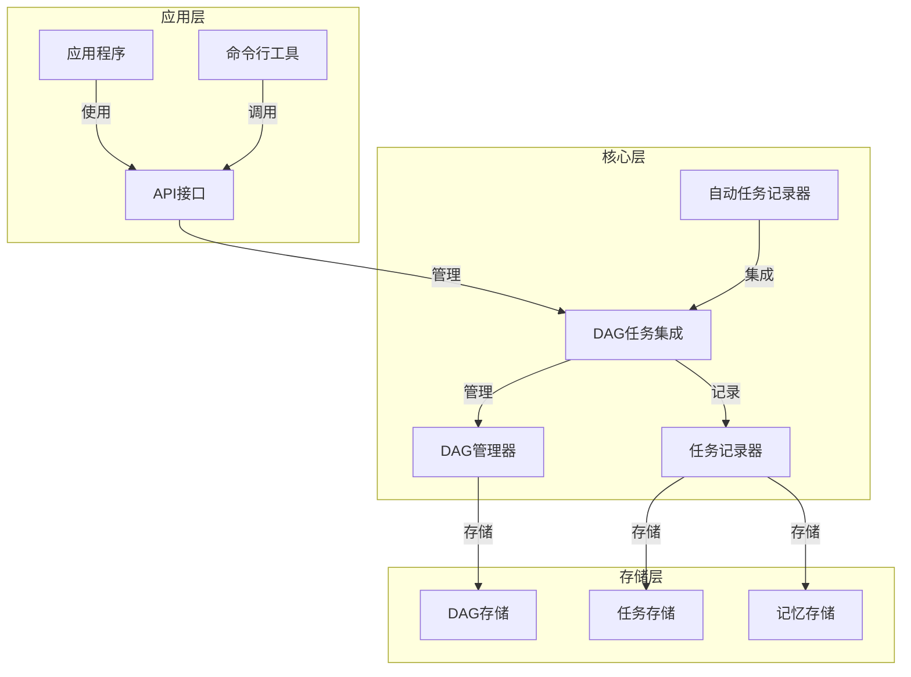

# DAG系统技术设计文档

## 1. 系统概述

**DAG (Directed Acyclic Graph) 系统**是一个基于有向无环图的数据管理和任务追踪系统，旨在提供灵活的数据关系管理、任务自动记录和知识图谱构建功能。

### 1.1 核心价值
- **任务自动记录**：自动捕获和记录系统中执行的任务
- **数据关系管理**：通过图结构表示复杂的数据关系
- **知识图谱构建**：基于任务执行和数据关系构建知识网络
- **可追溯性**：完整的任务执行历史和数据流转追踪
- **智能分析**：基于图结构的数据分析和推荐

### 1.2 应用场景
- 任务自动记录与管理
- 知识图谱构建与分析
- 数据关系可视化
- 工作流追踪与优化
- 智能推荐系统

## 2. 系统架构

### 2.1 整体架构



### 2.2 模块职责

| 模块 | 职责 | 文件位置 |
|------|------|----------|
| DAGManager | DAG图管理、节点/边操作、搜索算法 | src/superpowers/dag_manager.js |
| TaskRecorder | 任务记录、状态管理、报告生成 | src/superpowers/task_recorder.js |
| DAGTaskIntegration | DAG与任务系统集成 | src/superpowers/dag_task_integration.js |
| AutoTaskRecorder | 自动任务捕获与记录 | src/superpowers/auto_task_recorder.js |
| DAGTaskAutoRecorder | DAG任务自动记录器 | src/superpowers/dag_task_auto_recorder.js |

## 3. 核心功能

### 3.1 DAG管理功能
- **节点管理**：添加、更新、删除节点
- **边管理**：添加、删除边，建立节点间关系
- **图操作**：深度优先搜索、广度优先搜索
- **路径分析**：查找节点间路径，计算最长路径
- **图分析**：连通分量计算、图统计分析
- **导入导出**：DAG数据的导入导出

### 3.2 任务记录功能
- **任务创建**：创建新任务记录
- **任务状态管理**：更新任务状态（活跃、完成、失败）
- **任务关系**：建立任务间依赖关系
- **经验教训记录**：记录任务执行的经验教训
- **任务统计**：任务执行统计和分析
- **任务报告**：生成任务执行报告

### 3.3 自动记录功能
- **全局函数包装**：包装setTimeout、Promise等全局函数
- **模块包装**：包装fs、http、child_process等核心模块
- **任务自动捕获**：自动捕获系统执行的任务
- **DAG集成**：自动将任务记录到DAG系统

### 3.4 知识图谱功能
- **技能节点管理**：添加和管理技能节点
- **关系建立**：建立技能间的关联关系
- **使用统计**：跟踪技能使用情况
- **推荐算法**：基于图结构的智能推荐

## 4. 数据结构

### 4.1 DAG数据结构

```javascript
// DAG结构
{
  "nodes": {
    "node_id": {
      "id": "node_id",
      "type": "node_type", // task, skill, data, etc.
      "topic": "节点主题",
      "description": "节点描述",
      "status": "状态",
      "priority": "优先级",
      "createdAt": 1234567890,
      "updatedAt": 1234567890,
      "completedAt": 1234567890,
      "metadata": {
        "key": "value"
      }
    }
  },
  "edges": [
    {
      "id": "edge_id",
      "source": "source_node_id",
      "target": "target_node_id",
      "type": "edge_type", // depends_on, related_to, etc.
      "createdAt": 1234567890
    }
  ]
}
```

### 4.2 任务数据结构

```javascript
// 任务节点结构
{
  "id": "task_node_task_1234567890",
  "type": "task",
  "taskId": "task_1234567890",
  "status": "completed", // active, completed, failed
  "priority": "high", // high, medium, low
  "topic": "任务主题",
  "description": "任务描述",
  "createdAt": 1234567890,
  "updatedAt": 1234567890,
  "completedAt": 1234567890,
  "metadata": {
    "agent": "assistant",
    "project": "project_name",
    "tags": ["tag1", "tag2"],
    "outcome": {
      "success": true,
      "message": "任务结果"
    },
    "lessons": ["经验教训1", "经验教训2"]
  }
}
```

### 4.3 边数据结构

```javascript
// 边结构
{
  "id": "edge_1234567890_abc123",
  "source": "task_node_task_1234567890",
  "target": "task_node_task_1234567891",
  "type": "depends_on", // depends_on, related_to, produces, consumes
  "createdAt": 1234567890
}
```

## 5. 技术栈

| 技术 | 版本 | 用途 | 来源 |
|------|------|------|------|
| Node.js | v24+ | 运行环境 | package.json |
| JavaScript | ES2020+ | 开发语言 | 项目代码 |
| fs模块 | 内置 | 文件操作 | Node.js内置 |
| path模块 | 内置 | 路径处理 | Node.js内置 |
| uuid | ^10.0.0 | 生成唯一ID | 待安装 |
| JSON | - | 数据存储格式 | 项目代码 |

## 6. 迭代计划

### 6.1 第一阶段：基础功能完善

| 任务 | 描述 | 优先级 | 状态 |
|------|------|--------|------|
| 1.1 | 完善DAGManager核心功能 | 高 | 完成 |
| 1.2 | 实现TaskRecorder模块 | 高 | 完成 |
| 1.3 | 集成DAG与任务系统 | 高 | 完成 |
| 1.4 | 实现自动任务记录 | 高 | 完成 |
| 1.5 | 测试基础功能 | 中 | 完成 |

### 6.2 第二阶段：功能增强

| 任务 | 描述 | 优先级 | 状态 |
|------|------|--------|------|
| 2.1 | 实现DAG可视化 | 中 | 待开发 |
| 2.2 | 增强任务分析功能 | 中 | 待开发 |
| 2.3 | 实现智能推荐系统 | 中 | 待开发 |
| 2.4 | 优化存储性能 | 中 | 待开发 |
| 2.5 | 实现API接口 | 高 | 待开发 |

### 6.3 第三阶段：高级功能

| 任务 | 描述 | 优先级 | 状态 |
|------|------|--------|------|
| 3.1 | 实现实时监控 | 低 | 待开发 |
| 3.2 | 集成机器学习 | 低 | 待开发 |
| 3.3 | 实现分布式DAG | 低 | 待开发 |
| 3.4 | 开发Web界面 | 中 | 待开发 |
| 3.5 | 性能优化与测试 | 高 | 待开发 |

## 7. 性能优化

### 7.1 存储优化
- **文件存储优化**：使用压缩格式存储大型DAG
- **内存缓存**：频繁访问的节点和边缓存到内存
- **增量存储**：只存储变更部分，减少IO操作

### 7.2 算法优化
- **搜索算法优化**：使用更高效的图搜索算法
- **路径计算优化**：使用动态规划优化路径计算
- **并行处理**：使用多线程处理大型图操作

### 7.3 数据结构优化
- **索引结构**：为节点和边创建索引
- **数据压缩**：压缩存储数据，减少存储空间
- **批量操作**：支持批量添加节点和边

## 8. 扩展性设计

### 8.1 插件系统
- **插件接口**：定义标准插件接口
- **插件加载**：支持动态加载插件
- **插件管理**：提供插件管理功能

### 8.2 数据模型扩展
- **节点类型扩展**：支持自定义节点类型
- **边类型扩展**：支持自定义边类型
- **元数据扩展**：支持自定义元数据字段

### 8.3 存储后端扩展
- **存储适配器**：支持不同存储后端
- **云存储**：支持云存储服务
- **数据库集成**：支持关系型和NoSQL数据库

### 8.4 API扩展
- **RESTful API**：提供标准REST API
- **GraphQL API**：提供GraphQL查询接口
- **WebSocket API**：支持实时数据更新

## 9. 监控与维护

### 9.1 监控系统
- **健康检查**：定期检查DAG系统健康状态
- **性能监控**：监控系统性能指标
- **错误监控**：捕获和记录系统错误

### 9.2 维护工具
- **数据备份**：定期备份DAG数据
- **数据恢复**：支持数据恢复功能
- **数据清理**：清理过期数据
- **系统诊断**：提供系统诊断工具

### 9.3 日志系统
- **操作日志**：记录系统操作
- **错误日志**：记录错误信息
- **性能日志**：记录性能指标

## 10. 安全设计

### 10.1 数据安全
- **数据加密**：敏感数据加密存储
- **访问控制**：基于角色的访问控制
- **数据验证**：输入数据验证

### 10.2 系统安全
- **权限管理**：细粒度权限控制
- **审计日志**：记录系统操作审计
- **防止注入**：防止代码注入攻击

### 10.3 网络安全
- **API认证**：API访问认证
- **数据传输加密**：HTTPS传输
- **防止DDoS**：防止分布式拒绝服务攻击

## 11. 部署与集成

### 11.1 部署方式
- **本地部署**：单机部署
- **容器部署**：Docker容器部署
- **集群部署**：多机器集群部署

### 11.2 集成方式
- **Node.js模块**：作为Node.js模块集成
- **API服务**：作为独立API服务
- **CLI工具**：作为命令行工具
- **Web应用**：作为Web应用集成

### 11.3 依赖管理
- **依赖项**：管理项目依赖
- **版本控制**：语义化版本控制
- **兼容性**：确保向后兼容

## 12. 测试策略

### 12.1 单元测试
- **核心功能测试**：测试核心功能模块
- **边界测试**：测试边界条件
- **异常测试**：测试异常处理

### 12.2 集成测试
- **模块集成测试**：测试模块间集成
- **系统集成测试**：测试整个系统集成
- **性能测试**：测试系统性能

### 12.3 验收测试
- **功能验收**：验证功能是否符合需求
- **性能验收**：验证性能是否满足要求
- **安全验收**：验证安全性是否达标

## 13. 结论与展望

### 13.1 系统价值
- **提升开发效率**：自动化任务记录和管理
- **增强系统可观测性**：完整的任务执行历史
- **促进知识共享**：构建知识图谱
- **支持决策分析**：基于数据分析的决策支持

### 13.2 未来展望
- **智能化**：集成AI技术，实现智能任务推荐
- **自动化**：实现更多自动化功能
- **生态化**：构建完整的DAG生态系统
- **标准化**：推动DAG标准的建立

### 13.3 实施建议
- **循序渐进**：分阶段实施，逐步完善
- **用户反馈**：持续收集用户反馈
- **技术创新**：不断探索新技术
- **社区建设**：建立活跃的开发者社区

---

**文档版本**: 1.0
**最后更新**: 2026-04-23
**作者**: System
**状态**: 初稿